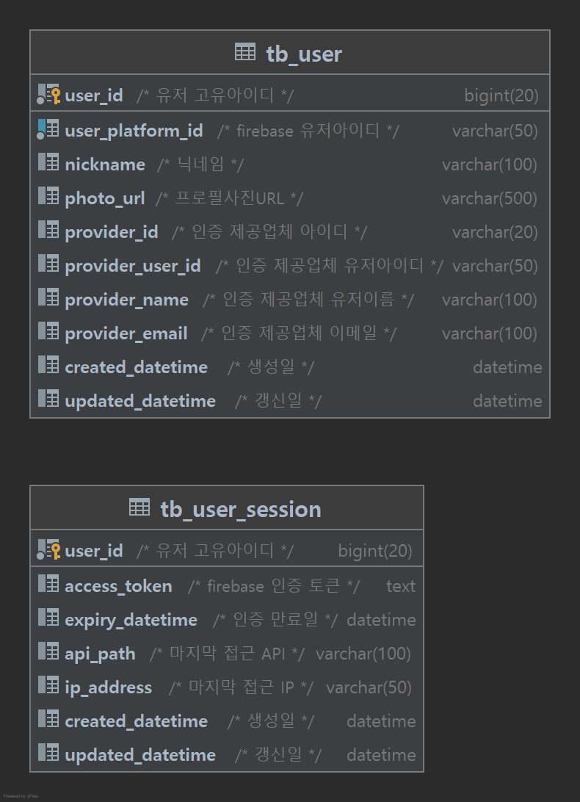

# .NET 백엔드 프로젝트

## 개요
- ASP.NET Core WebApplication 을 이용하여 백엔드 게임서버 API 구축을 빠르게 하기 위함

## 사용된 기술
- .NET SDK 6.0
- MySQL 5.7.x

## Third Library
- MessagePack : 클라이언트 서버간 통신시 직열화를 위해 사용
- ZLogger : Zero Allocation Text/Structured Logger
- FirebaseAdmin : 인증 연동을 위해 Firebase 사용

## .NET SDK, Runtime
- <https://dotnet.microsoft.com/download/dotnet/6.0>

## Entity Framework Core 도구 설치
```
dotnet tool install --global dotnet-ef
```
## 개발 환경 구축
- WSL2 Ubuntu 20.04 설치

### MySQL 5.7
```
sudo apt install -y gnupg2
wget https://repo.percona.com/apt/percona-release_latest.$(lsb_release -sc)_all.deb
sudo dpkg -i percona-release_latest.$(lsb_release -sc)_all.deb
sudo apt update
sudo apt install -y percona-server-server-5.7
```
```
#/etc/mysql/conf.d/my.cnf

[client]
default-character-set = utf8mb4

[mysqld]
character-set-server = utf8mb4
collation-server = utf8mb4_unicode_ci

[mysql]
default-character-set = utf8mb4
```

## 프로젝트 구성
- RxCats.Core : 공통 라이브러리
- RxCats.DbMigration : 데이터베이스 스키마 관리용 Console 프로젝트
- RxCats.GameApi : 게임 API 프로젝트

## ERD


## 코드 설명

### RxCats.GameApi

#### Filter
```c#
// Exception 발생시 에러 응답 메시지를 만들어 주는 용도
namespace RxCats.GameApi.Filter;

public class GlobalExceptionFilter : IExceptionFilter
{
}
```

```c#
// 로그인 이후 API 에서 Request 의 헤더값에 `X-UserId` 및 `X-AccessToken` 을 체크하기 위한 용도
namespace RxCats.GameApi.Filter;

[AttributeUsage(AttributeTargets.Class | AttributeTargets.Method)]
public class ValidateSession : ActionFilterAttribute
{
}
```

#### Middleware
```c#
// Content-Type 이 `application/x-msgpack` 인 경우 Request 및 Response 를 Logging 하기 위한 용도
namespace RxCats.GameApi.Middleware;

public class MessagePackLoggingMiddleware
{
}
```

```c#
// Content-Type 이 `application/json` 인 경우 Request 및 Response 를 Logging 하기 위한 용도
namespace RxCats.GameApi.Middleware;

public class JsonLoggingMiddleware
{
}
```

#### Provider
```c#
// 로그인시 Request 의 AccessToken 을 체크하기 위한 용도
// 구현체 : RxCats.GameApi.Provider.Impl.FirebaseProvider.cs
namespace RxCats.GameApi.Provider;

public interface IAccessTokenValidateProvider
{
    Task ValidateAccessToken(string userPlatformId, string accessToken);
}
```

#### DbContext
```c#
// Entity Framework Core 이용시 DB CRUD 를 공통으로 사용하기 위한 용도
// 구현체 : RxCats.GameApi.Repository.Impl.DbOperations.cs
namespace RxCats.GameApi.Repository;

public interface IDbOperations<TEntity>
{
    Task<TEntity?> FindById(object id);

    Task Insert(TEntity entity);

    Task Delete(object id);

    void Delete(TEntity entityToDelete);

    void Update(TEntity entityToUpdate);

    Task Save();
}
```

```c#
// DB 작업을 사용할 경우 인스턴스 생성 후 사용하는 용도
namespace RxCats.GameApi.Repository;

public class GameRepository : IDisposable
{
}
```
 